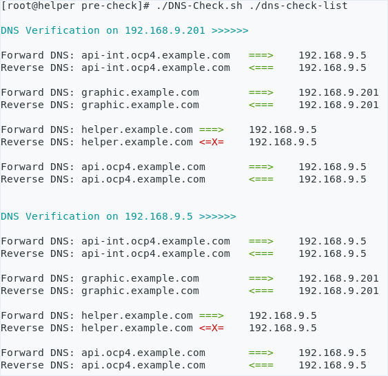

# DNS-Check

**Introduction**

The script is to verify the forward and reverse DNS on specified host.

The script have 1 paramters.

```
[root@helper pre-check]# ./DNS-Check.sh ./dns-check-list

```

1st paramter is the file including "role,hostname,ip,port".

Sample input file:
```
# cat ./dns-check-list
controller,api-int.ocp4.example.com,192.168.9.5,443
controller,graphic.example.com,192.168.9.201,443
controller,helper.example.com,192.168.9.5,443
auto-hub,api.ocp4.example.com,192.168.9.5,443
```


**Prerequisite**

- script has passwordless ssh access to the servers listed in file server_list.

**Sample output**


